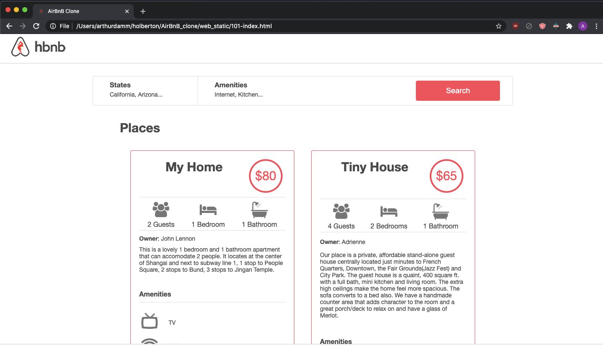

# 0x00. AirBnB clone - The console

This task was done in teams of 2 :

The goal of the project is to deploy on your server a simple copy of the [AirBnB website.](https://intranet.alxswe.com/rltoken/m8g02HcD2ovrl_K-zulYBw)

We won’t implement all the features, only some of them to cover all fundamental concepts of the higher level programming track.

After 4 months, we will have a complete web application composed by:

    A command interpreter to manipulate data without a visual interface, like in a Shell (perfect for development and debugging)
    
    A website (the front-end) that shows the final product to everybody: static and dynamic
    
    A database or files that store data (data = objects)
    
    An API that provides a communication interface between the front-end and your data (retrieve, create, delete, update them)

## Final product

# Concepts to learn

>[Unittest](https://intranet.alxswe.com/rltoken/87ml5W9WzLbH7yAJuGk_mA) 

>Python packages concept page

>Serialization/Deserialization

>*args, **kwargs

>datetime

# Steps

We won’t build this application all at once, but step by step.

Each step will link to a concept:

## The Console
    >create data model
    
    >manage (create, update, destroy, etc) objects via a console / command interpreter
    
    >store and persist objects to a file (JSON file)

The first piece is to manipulate a powerful storage system. This storage engine will give us an abstraction between “My object” and “How they are stored and persisted”. This means: from the console code (the command interpreter itself) and from the front-end and RestAPI (which we will build later)

This abstraction will also allow us to change the type of storage easily without updating all of your codebase.

The console will be a tool to validate this storage engine

## The Web Static

    >learn HTML/CSS

    >create the HTML of your application

    >create template of each object

## MySQL storage

    >replace the file storage by a Database storage

    >map our models to a table in database by using an O.R.M.

## Web framework - templating
    >create our first web server in Python

    >make our static HTML file dynamic by using objects stored in a file or database

## RESTful API

    >expose all your objects stored via a JSON web interface

    >manipulate your objects via a RESTful API

## Web dynamic
    >learn JQuery

    >load objects from the client side by using your own RESTful API

# Command Interpreter

This is a simple framework for writing line-oriented command line interpreters

The cmd module contains one public class,***the Cmd class*** designed to be used as a base class for command processors such as interactive shells and other command interpreters.

Creating a command line interpreter is done by sub-classing the cmd.Cmd class.

By default it uses ***readline** for interactive prompt handling , command line editing and command completion

## Advantages of cmd

    >>portability almost any computer is able to drive a text terminal, so a command line interface can really run everywhere.

    >>resources the CPU and memory cost of a command line interface is far lighter than a GUI library.

    >>speed for advanced users, it's often faster to type a command than to dive into menus and windows.

    >>development It is far faster to create a text oriented interface.

    >>driving you can easily drive a text oriented program with the popen command. That means that the whole application can be tested automatically.

# Contributors

[Kiptoo Caleb](https://github.com/kiptoobarchok)

[Victor Ndudim](https://github.com/Pa-vic)